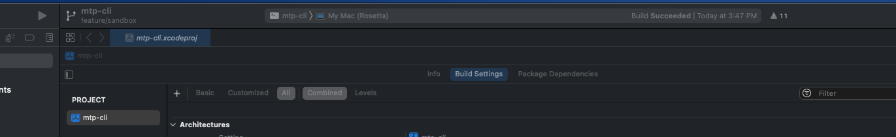

# mtp-cli

mtp-cli is a MacOS application that implements Microsoft's Media Transfer Protocol (MTP)

# Building

1. Open the terminal
1. Type 'brew install libmtp'
1. Navigate to the directory where you cloned the project
1. Type 'git checkout feature/sandbox'
1. Open the mtp-cli.xcodeproj
1. If you are using an Apple Silcon Mac change the xcode build setting to My Mac (Rosetta)
   
1. Tap Command + B to build the project

# Development

- XCode is needed to build and publish the application.
- Homebrew is needed to install the libmtp package
